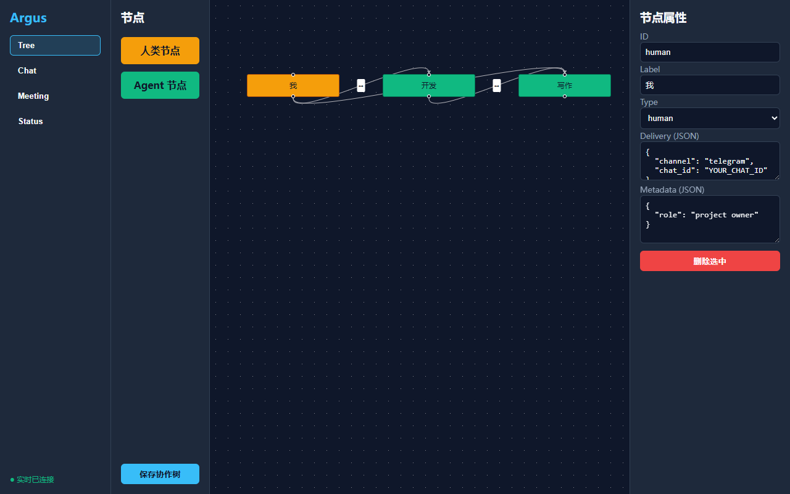
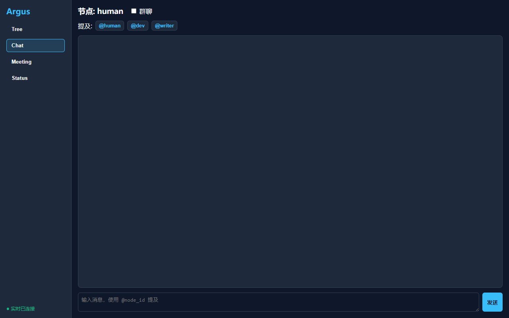
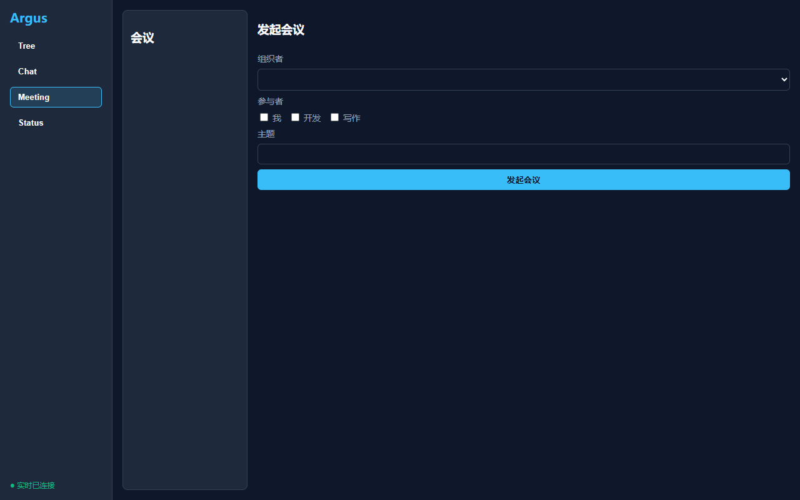
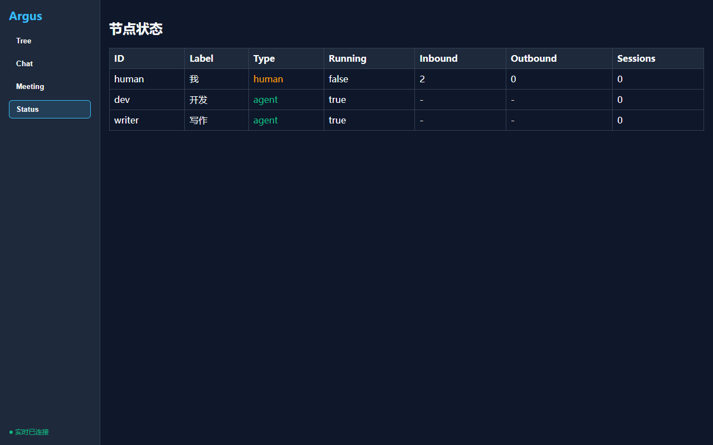

# Argus

Argus 是一个多 Agent 协作编排平台，让人类可以通过协作树（Collaboration Tree）自由定义自己与多个 AI Agent 的通信拓扑，实现私聊、群聊、会议等原生多 Agent 协作模式，并建立可传承的团队记忆系统。

## 核心特性

- **协作树编排**：用 YAML/JSON 声明节点（human / agent）与有向/双向通信边，完全由用户自定义协作拓扑。
- **私聊 / 群聊 / 广播**：基于协作树连线实现单聊、@mention 群聊、@all 广播，并自动过滤不可达节点。
- **会议引擎**：发起会议后自动通知参与者、轮流请求 Agent 发言、广播发言内容、进入自由讨论并归档纪要。
- **五层记忆传承**：项目记忆、团队最佳实践、Agent 成长档案、会议纪要库、协作模式库，支持基于项目类型推荐历史协作树。
- **可视化 GUI**：基于 Tauri 2.0 + Vue 3 的桌面客户端，支持拖拽编辑协作树、聊天视图、会议视图与状态面板。
- **CLI Gateway**：`argus onboard` / `argus gateway` / `argus agent` / `argus status` 命令行入口。

## 功能展示

想要快速了解 Argus 能做什么，可以查看 [docs/showcase.md](docs/showcase.md)。下面是 GUI 主要界面的截图预览：

| 协作树编辑 | 节点聊天 |
|------------|----------|
|  |  |

| 会议视图 | 状态面板 |
|----------|----------|
|  |  |

## 快速安装

需要 Python 3.11+。

```bash
git clone <repo-url>
cd argus
pip install -e .
```

安装后会获得 `argus` 包与 `argus` 命令行入口。

## 快速开始

### 1. 初始化工作空间

```bash
argus onboard
```

该命令会在 `~/.argus/` 创建默认配置、示例协作树与五层记忆目录。

如果你不想使用 `argus onboard`，也可以手动创建工作目录并复制示例配置：

```bash
mkdir my-argus-workspace
cp config/example_config.json my-argus-workspace/config.json
cp config/example_tree.yaml my-argus-workspace/collaboration_tree.yaml
```

然后编辑 `config.json`，将 `providers.deepseek.apiKey` 替换为你的真实 API Key。

### 2. 查看并编辑协作树

```bash
# 查看当前可达性
argus status

# 编辑 ~/.argus/collaboration_tree.yaml
```

示例协作树包含 `human`、`dev`、`writer` 三个节点，彼此双向连接。

### 3. 启动 Gateway

```bash
argus gateway
```

Gateway 会加载配置、启动所有 Agent 节点、启动 GUI 后端 HTTP/WebSocket 服务，并持续运行直到收到 `Ctrl+C`。

### 4. 以人类节点身份交互

```bash
argus agent --node human -m "@dev 你好，请帮我看一下这个需求"
```

### 5. 通过 GUI 操作

在浏览器中打开 `http://127.0.0.1:18792`（默认端口），即可使用协作树编辑器、聊天视图与会议视图。

## 项目结构

```
argus/
├── argus/                  # Argus 主包
│   ├── adapters/           # Agent 运行时适配层
│   ├── cli/                # Typer CLI
│   ├── config/             # 配置 schema 与加载器
│   ├── core/               # 协作树、消息总线、路由器、会议引擎、编排器
│   ├── gui/                # GUI 后端 FastAPI/UVicorn 服务
│   └── memory/             # 五层记忆存储
├── gui/                    # Tauri 2.0 + Vue 3 桌面前端
├── config/                 # 示例协作树配置
├── memory/                 # 示例记忆目录
├── tests/                  # 单元测试与端到端测试
│   ├── cli/
│   ├── core/
│   ├── e2e/
│   └── gui/
├── docs/                   # 文档
├── pyproject.toml
└── README.md
```

## 运行测试

```bash
python -m pytest tests -q
```

端到端测试位于 `tests/e2e/`，使用 Fake Agent 与临时目录，不会调用真实 LLM，也不会影响 `~/.argus`。

### 验证 human 接管会议与 inbox 持久化

仓库提供了一个不调用 LLM 的端到端验证脚本，用于快速确认 human 节点相关功能：

```bash
NO_LLM=1 python scripts/validate_human_features.py
```

该脚本会：
1. 启动真实 Orchestrator（使用 mock agent，不消耗 API）。
2. 验证 human 离线时消息被持久化到 inbox，上线后自动 drain。
3. 验证会议中 human 可以 `skip_turn`、`update_topic`、`close`。

如果需要真实 LLM 验证，去掉 `NO_LLM=1` 并确保 `config.json` 中配置了有效 API Key。

## 开发提示

- `.mock-argus/`、`.real-test-argus/`、运行时日志、GUI 构建产物和 Python 缓存均已在 `.gitignore` 中排除，不会被提交。
- 示例配置位于 `config/example_config.json`，其中 API Key 为占位符，请在使用前替换。
- GUI 前端构建已通过 `npm run build`；要启动 Tauri 桌面窗口需要本地安装 Rust 工具链。

## 许可证

MIT License
