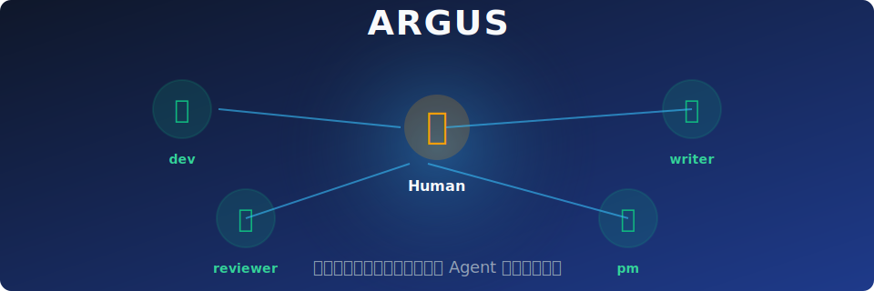
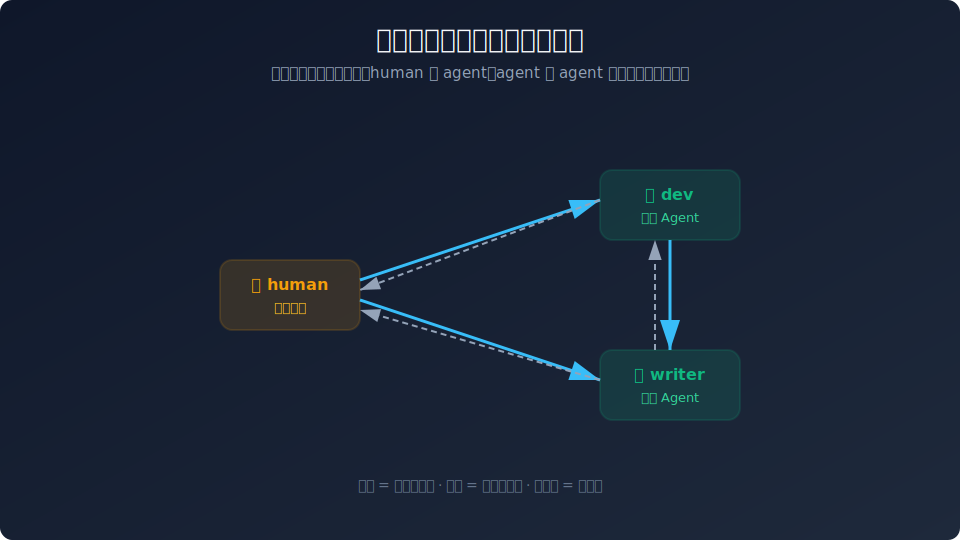
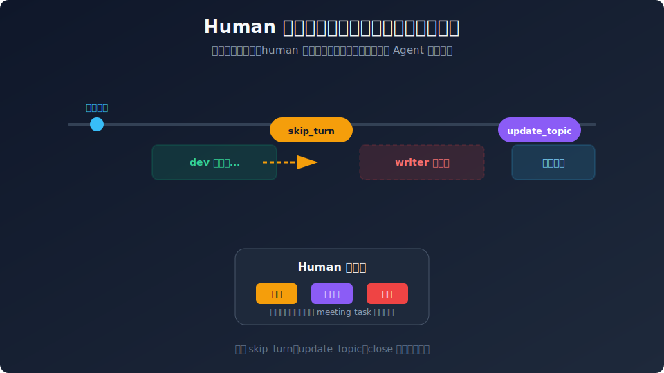
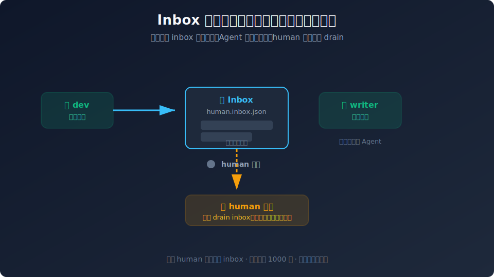

# Argus Showcase

[English](showcase_en.md) | [中文](showcase.md)

> Argus = a multi-agent collaboration operating system that is **observable, takeover-ready, and inheritable**.



---

## Core Capabilities

| Capability | Description | Best For |
|------------|-------------|----------|
| **Collaboration Tree** | Define communication links between humans and agents with a directed graph | Multi-role project teams |
| **Message Bus** | Private/group chat routed by reachability, with `@mention` filtering | Targeted notifications, group discussions |
| **Meeting Engine** | Round-robin speeches + free discussion, running asynchronously in the background | Design reviews, iteration planning |
| **Human Takeover** | `skip_turn` / `update_topic` / `close` | Critical decisions that need human oversight |
| **Inbox Persistence** | Offline messages are persisted to disk and drained automatically on reconnect | Async collaboration, cross-timezone teams |
| **Five-Layer Memory** | Project / team / individual / meeting / pattern memories accumulate layer by layer | Experience reuse, long-running projects |
| **GUI / CLI** | Tauri + Vue3 desktop interface + Python CLI | Local debugging, daily operations |

---

## 1. Collaboration Tree: Boundaries for Communication



Argus does not assume every node can talk to every other node. Communication is explicitly defined by **directed edges**:

- **Solid arrow**: messages can be sent
- **Dashed arrow**: replies can be sent back
- **No connection**: unreachable, messages are blocked

This brings two benefits:
1. **Security**: sensitive information is not delivered to unrelated agents.
2. **Clarity**: team topology as code, newcomers can understand the organization at a glance.

> Use case: in a product team, the PM only sends requirements to dev; dev and writer collaborate with each other; writer cannot directly release to PM.

---

## 2. Human Meeting Takeover: Machines Run Meetings, Humans Hold the Veto



Once a meeting starts, agents speak in round-robin order. Humans do not need to wait; they can insert control commands into the command queue at any time:

- `skip_turn`: skip the current agent's speech
- `update_topic`: dynamically change the meeting topic
- `close`: end the meeting immediately

The entire meeting runs in a **background task**, and human commands are handled asynchronously without blocking the daily work of other agents.

> Use case: let agents automatically review PRs overnight; in the morning, the human finds one agent stuck and simply runs `skip_turn` to continue.

---

## 3. Inbox Persistence: Offline but Not Disconnected



Human nodes go offline. Argus handles it as follows:

1. While the human is offline, messages addressed to them go into `human_inboxes/{node_id}.inbox.json`.
2. Agents continue their own work, **without being blocked**.
3. When the human reconnects, the inbox is automatically drained and all offline messages are pushed at once.

Each human has an independent inbox with a capacity limit of 1000 messages, and messages survive restarts.

> Use case: the founder attends meetings during the day; agents automatically compile a daily report overnight; the next morning, all messages are waiting in Argus.

---

## 4. Example Usage Scenarios

### Scenario A: AI Startup Team

- **human**: founder
- **agents**: dev (writes code), writer (writes copy), pm (organizes requirements)
- **collaboration tree**: founder connects to everyone; dev and writer collaborate bidirectionally; pm receives input from founder unidirectionally.
- **typical meeting**: "Next week's product iteration planning", organized by pm, with dev and writer speaking; the founder can `skip_turn` or `update_topic` at any time.

### Scenario B: 24x7 Automated Operations

- **human**: on-call engineer
- **agents**: monitor, debugger, executor, reporter
- **collaboration tree**: monitor detects anomalies → debugger analyzes → executor applies fixes → reporter generates a report for the human.
- **inbox persistence**: anomaly reports are queued while the human is offline and delivered immediately after reconnect.

### Scenario C: Content Production Pipeline

- **human**: editor-in-chief
- **agents**: researcher, writer, editor, reviewer
- **meeting mode**: "This month's special topic planning", researcher provides materials first, writer drafts, editor polishes, reviewer checks, and the editor-in-chief finally runs `close` to finalize.

---

## 5. Try the GUI Quickly

```bash
# Zero LLM API cost, uses mock agents
python scripts/start_gui_for_demo.py
```

Then open http://127.0.0.1:18793 to see:

- **Tree**: visually edit the collaboration tree
- **Chat**: private or group chat by node
- **Meeting**: start meetings and view status in real time
- **Status**: view online/running status of all nodes

> Note: to start real LLM mode, copy `config/example_config.json` and fill in your own API key.

---

## 6. Technical Highlights

- **Spec-driven**: started from the project requirements doc and implemented every detail step by step.
- **Memory inheritance**: the five-layer memory architecture makes experience accumulable and transferable.
- **Async by default**: all message routing and meeting execution is asynchronous, ensuring system responsiveness.
- **Mock mode**: `mock=True` enables zero-cost execution of all features, convenient for development and demos.

---

*Argus is for teams that want multiple AI agents to truly collaborate while keeping final human decision-making power.*
